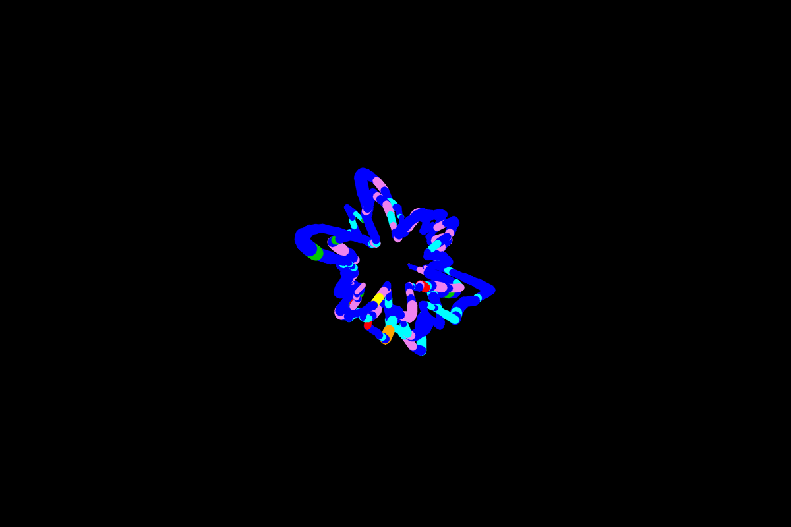
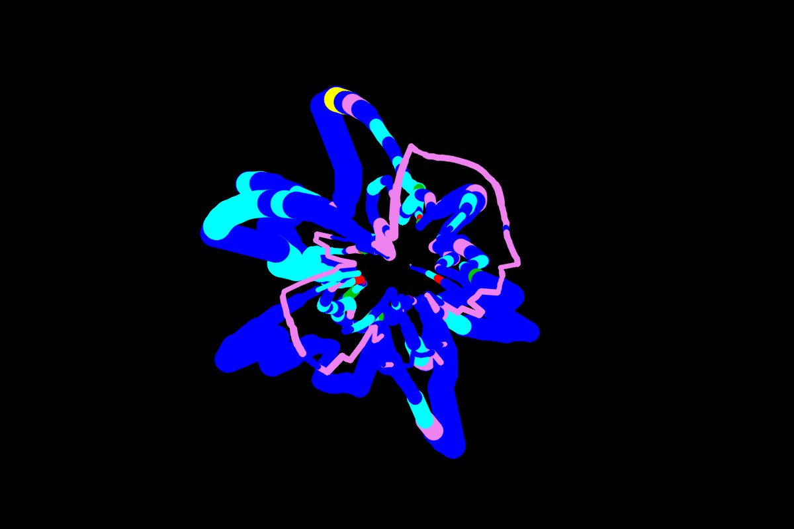

# 🎙️ Vocal Painter

> **Paint with your voice.** Sing, hum, or whisper — and watch a living flower bloom on screen in real time.

Vocal Painter is a creative audio-visual project that maps your voice directly onto a canvas. Every note you hold, every shift in tone, every burst of volume shapes the brush — turning your singing into a unique piece of generative art.

---

## 🖼️ Gallery

<p align="center">
  
  &nbsp;
  
</p>

---

## ✨ How It Works

Your voice has three measurable properties. Each one controls something on the canvas:

| Voice Property | What It Measures | What It Paints |
|---|---|---|
| **Pitch** (Hz) | How high or low your note is | Radius — high notes push the brush outward, low notes pull it inward |
| **Amplitude** (RMS) | How loud you are | Stroke thickness + petal wobble depth |
| **Spectral Centroid** (Hz) | The brightness/tone colour of your voice | Stroke colour — bright/airy = warm (red, orange) · dull/deep = cool (blue, violet) |

The brush orbits the center of the canvas in a continuous spiral. Over time, as pitch and volume shift, the orbit traces a flower-like mandala — no two sessions are ever the same.

---

## 🌸 Features

- **Orbital brush** — angle increases steadily every audio frame, spinning the brush like a clock hand
- **Pitch-driven radius** — your note stretches or shrinks the orbit in real time
- **Petal wobble** — louder voice creates bumpy petal-edge bumps using a sine wave (`6 bumps per orbit`)
- **Bloom burst** — hold a loud note for 1 second and the radius surges outward for 2.5 seconds, like a petal opening
- **Smooth colour flow** — spectral centroid maps across an 8-colour palette (indigo → violet → blue → cyan → green → yellow → orange → red)
- **Auto-save** — every session is saved as `artwork/painting_NNN.png` when you quit
- **Infinite canvas time** — paint as long as you want; quit with `Q` or `ESC`
- **SPACE to clear** — wipe the canvas and start a new bloom

---

## 🗂️ Project Structure

```
vocal_painter/
│
├── vocal_painter.py   # main: OpenCV draw loop + orbital brush logic
├── vocal.py           # audio feature extraction (pitch, amplitude, centroid)
├── paint.py           # maps audio features → brush properties (y, thickness, color)
│
├── artwork/           # auto-created; saved paintings go here
├── flowchart.md       # full system flowchart (Mermaid)
├── requirements.txt
└── README.md
```

---

## 🚀 Getting Started

### 1. Clone the repo

```bash
git clone https://github.com/your-username/vocal_painter.git
cd vocal_painter
```

### 2. Create a virtual environment

```bash
python3 -m venv .venv
source .venv/bin/activate
```

### 3. Install dependencies

```bash
pip install -r requirements.txt
```

### 4. Run it

```bash
python vocal_painter.py
```

Sing or hum into your microphone — the painting begins immediately.

---

## 🎮 Controls

| Key | Action |
|---|---|
| `SPACE` | Clear the canvas and start fresh |
| `Q` or `ESC` | Quit and auto-save the painting |
| Close button | Same as Q — painting is saved |

---

## 📐 System Flowchart

See [flowchart.md](flowchart.md) for the full Mermaid diagram of the system architecture.

A quick summary:

```
Microphone
    │
    ▼
extract_features()  ──→  pitch, amplitude, spectral centroid
    │
    ▼
features_to_brush() ──→  y position, thickness, color name
    │
    ▼
BrushSmoother       ──→  moving-average smoothing (removes jitter)
    │
    ▼
Draw Loop           ──→  radius = base + pitch_var + wobble + bloom_boost
                         curr_pt = center + radius × (cos θ, sin θ)
                         cv2.line(prev_pt → curr_pt)
                         angle += 0.04 rad per frame
```

---

## 📦 Dependencies

```
librosa        — audio analysis (pitch detection via YIN, spectral centroid)
sounddevice    — real-time microphone input
numpy          — fast array math for audio buffer and canvas
opencv-python  — canvas window, drawing primitives, image save
```

---

## 📄 License

This project is licensed under the terms of the [LICENSE](LICENSE) file included in this repository.

---

## 📸 Follow Along

Made with 🎙️ + 🎨 by **Sonal Kumari** — follow for more ML creative projects:

<p align="center">
  <a href="https://www.instagram.com/themlguppy/">
    
  </a>
</p>
