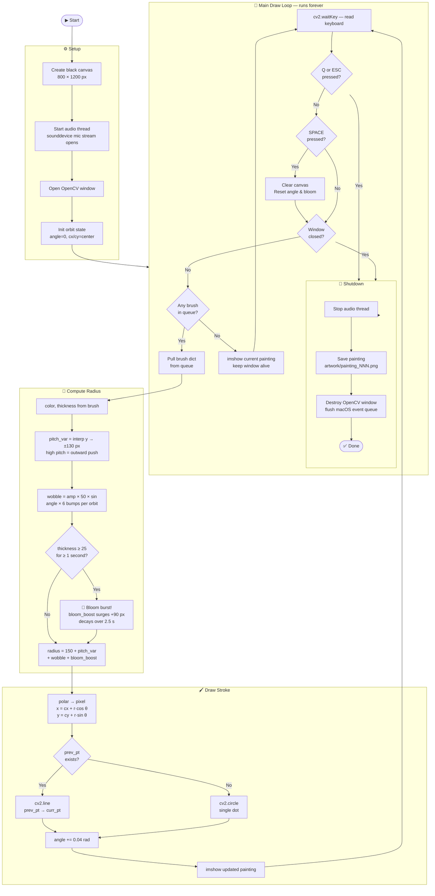

# Vocal Painter — Flowchart

## How each voice feature maps to the brush

| Voice feature | How it's measured | What it controls |
|---|---|---|
| **Pitch** (Hz) | YIN algorithm in `vocal.py` | Radius — high note = brush moves outward |
| **Amplitude** (RMS) | Root-mean-square of the audio frame | Stroke thickness + wobble depth + bloom arming |
| **Spectral centroid** (Hz) | Weighted average frequency | Stroke colour — bright/high = warm (red/orange), dull/low = cool (blue/violet) |
